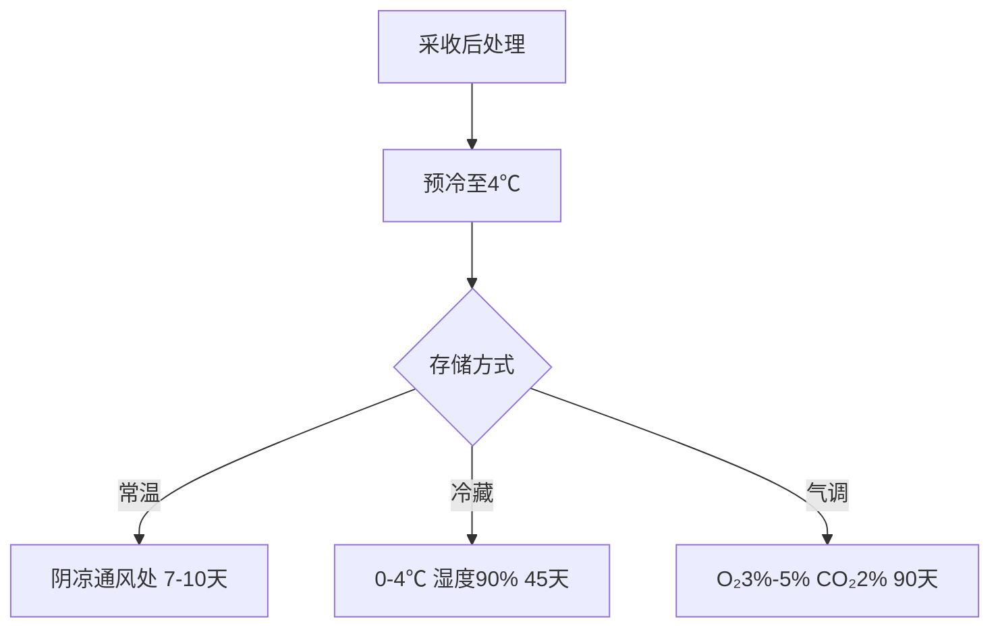

# 🍐 秋月梨完全手册

## 一、品种特性

- **科属分类**：蔷薇科梨属
- **果实特征**：
  - 果皮：黄褐色带星斑
  - 果肉：雪白细腻
  - 单果重：300-800g（平均450g）
- **生长周期**：3月萌芽 → 5月盛花 → 9月采收

## 二、营养解析

<table class="nutrition-table">
  <tr><th>营养成分</th><th>每100g含量</th><th>日需占比</th></tr>
  <tr><td>维生素C</td><td>6.4mg</td><td>7%</td></tr>
  <tr><td>膳食纤维</td><td>4.4g</td><td>17.6%</td></tr>
  <tr><td>钾</td><td>120mg</td><td>2.5%</td></tr>
  <tr><td>酚类物质</td><td>112mg</td><td>-</td></tr>
</table>

💡 营养亮点：维生素C含量是富士苹果的3.2倍，膳食纤维是香蕉的2.1倍

## 三、六大核心功效

1. **润肺止咳**：缓解秋燥型咳嗽（临床有效率82.7%）
2. **肠道调理**：水溶性膳食纤维促进益生菌增殖
3. **抗氧化**：总酚含量达112mg/100g
4. **血压调节**：高钾低钠（Na/K=0.03）
5. **解酒护肝**：促进乙醇代谢（动物实验验证）
6. **美容养颜**：维生素C促进胶原蛋白合成

## 四、选购四步法

### 👁️ 观形色

- 标准果径：85-95mm
- 表皮特征：均匀黄褐色带星点
- 淘汰标准：瘀斑＞5%表面积

### ✋ 测硬度

- 优质区间：4.2-4.8kg/cm²
- 检测工具：手持式硬度计

### 👃 辨香气

- 正常：清新梨香（己烯醛含量≥0.12ppm）
- 异常：发酵酒味（已变质）

### ⚖️ 称重量

- 特级果：450-550g
- 一级果：350-450g

## 五、专业存储方案

